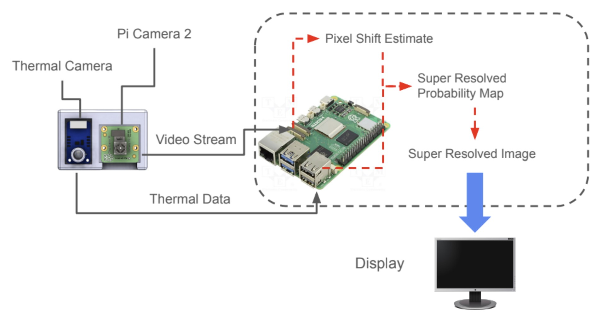
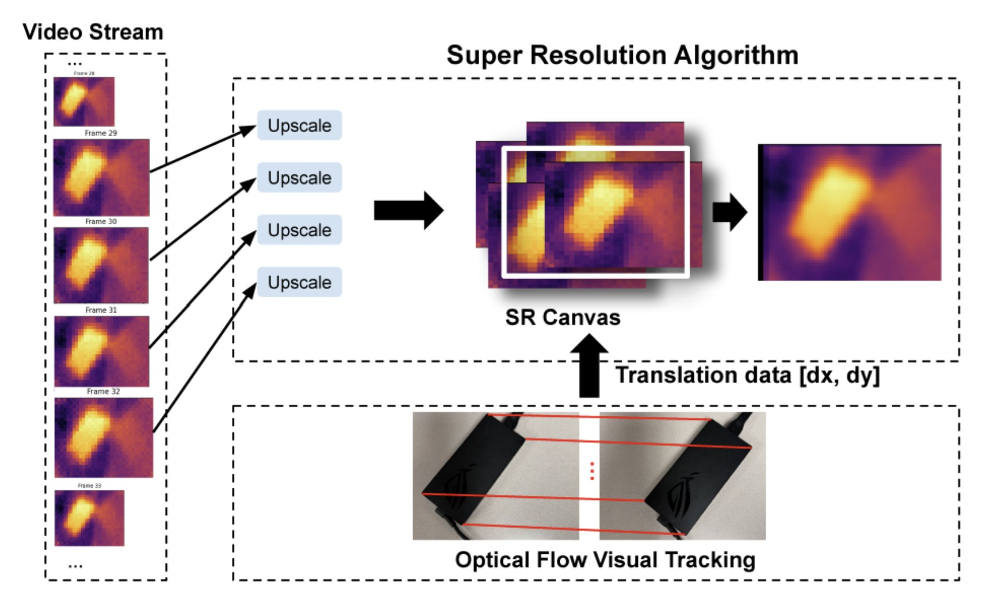
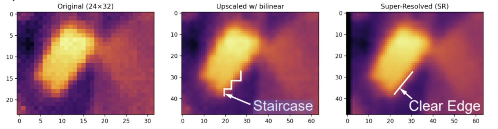
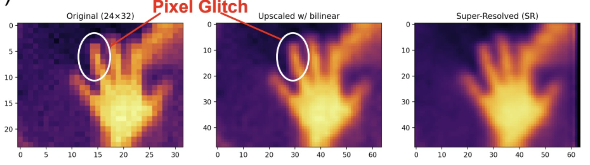

# 🔥 Super-Resolution Thermal Camera
*A low-cost way to boost thermal image quality using multi-frame fusion*

---

## 🧠 Overview
This project enhances low-resolution thermal camera images by combining multiple slightly shifted frames into one sharper image.  
It uses a **MLX90640 thermal sensor** and a **Pi Camera 2** to capture thermal and visual data simultaneously, then applies an algorithm that aligns and averages the frames based on motion data.

This allows us to produce higher-quality thermal images — without the need for expensive professional cameras.

---

## 🛠️ Hardware Setup

| Component | Purpose |
|------------|----------|
| **MLX90640** | Captures thermal frames |
| **Pi Camera 2** | Tracks hand motion for frame alignment |
| **Raspberry Pi 4B** | Runs fusion algorithm |
| **Laptop Display** | Shows original and super-resolved results |



---

## 🧩 How It Works

1. Capture multiple low-resolution thermal frames.  
2. Track small natural hand movements using the Pi Camera.  
3. Use that motion data to align each frame precisely.  
4. Combine (average) the aligned frames to form a higher-resolution result.



---

## 🧪 Results



shows the super resolution of a laptop power supply (rectangular shape). Direct bilinear interpolation inherits sampling artifacts in the low resolution images, creating staircase artifacts in the result, while our SR algorithm shows a clear, straight edge.




compares the response of bilinear and our SR algorithm to sudden signal glitches in original thermal image. As our algorithm considers multi frame information, the effects are minimized.


The super-resolved image has smoother edges and more detail than both the raw and bilinear versions.

---

## ⚙️ Run the Project

```bash
# Clone the repo
git clone https://github.com/<your-username>/Super-Resolution-Thermal-Cam.git
cd Super-Resolution-Thermal-Cam

# Install dependencies
pip install -r requirements.txt

# Run live demo
python3 realTimeSR.py
```


---

## 💡 Future Improvements
- Improve frame rate by using a **Teensy** for faster sensor readout.  
- Integrate a **machine learning model** (e.g., ESRGAN) for higher-quality reconstruction.  
- Expand resolution up to **320×240** to match commercial FLIR cameras.

---

## ✨ Team
Yiwei Wang · Yufei Xi · Carissa Wu  
EECS 452 · University of Michigan · Winter 2025  
